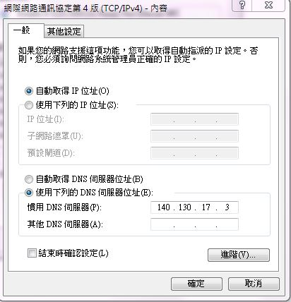
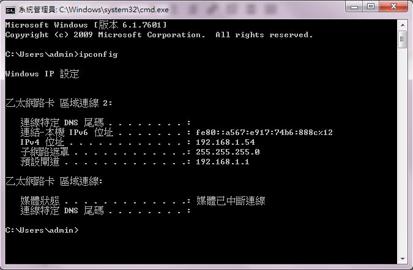
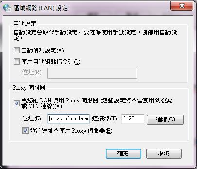

# 第十週工作內容

必須將Leo從4.1升級成5.1

[Leo升級到5.1版本](http://wordpress-2015course.rhcloud.com/?p=1387)

如何更新:

* 
下載原始碼: https://github.com/leo-editor/leo-editor/releases/tag/Leo-5.1-final
* 
先刪除舊版的 V:\IDE\Python33\Lib\site-packages\leo 目錄 ，或是將其修改成leo1以備不時之需
* 
解開壓縮檔案後, 將 leo 目錄放到 V:\IDE\Python33\Lib\site-packages\ 目錄中
* 
啟動隨身程式系統後, 利用 Leo Editor 系統中的 Help->About Leo 檢查是否版次為 5.1

 

將proxy設定成本系伺服主機

* 
到控制台>
* 
網路和網際網路>
* 
網路和共用中心>
* 
區域連線(區域連線2)>
* 
內容>
* 
網際網路通訊協定第四版(TCP/Pv4)
* 
內容>
* 
將使用下列DNS伺服位置器位址底下慣用DNS伺服器改成 140.130.17.3
* 

 
  
 
如何查看電腦伺服器位址：

於系統管理員(cmd)下輸入ipconfig即可查看

 
 

到瀏覽器的設定端修改proxy

設定>
變更proxy設定>
LAN設定>
將自動偵測移除>
將底下的proxy伺服器位址改成proxy.nfu.mde.edu.tw

